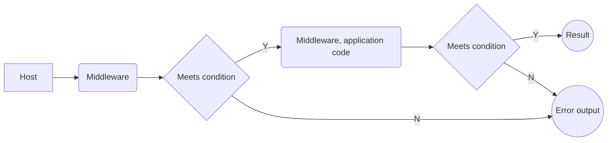

# .Net Core 2

## Owin
Owin was created to decouple servers from applications. It basically consists of querying and transforming the request\response pipeline in a modular fashion.



_**Server**  – The HTTP server that directly communicates with the client and then uses OWIN semantics to process requests. Servers may require an adapter layer that converts to OWIN semantics._

_**Web Framework**  – A self-contained component on top of OWIN exposing its own object model or API that applications may use to facilitate request processing. Web Frameworks may require an adapter layer that converts from OWIN semantics._

_**Web Application**  – A specific application, possibly built on top of a Web Framework, which is run using OWIN compatible Servers._

_**Middleware**  – Pass through components that form a pipeline between a server and application to inspect, route, or modify request and response messages for a specific purpose._

_**Host**  – The process an application and server execute inside of, primarily responsible for application startup. Some Servers are also Hosts._


The host provides an environmental dictionary in the form _**IDictionary<string, object>**_.  This is a list containing all of the relevant information about the request, response, and server/host information. In addition servers, host environments, middleware, and application code may add additional data, or modify the data in the dictionary as a result of processing.

In light of this, each middleware component needs to provide an  'AppFunc' 
 ```Func<AppFunc, AppFunc>``` delegate to be called in order to do its own work in the pipeline, and also needs to receive a reference to the next  'AppFunc'  delegate, to be called (in most cases) once the current component has completed processing.

In other words, a middleware can be expressed with a signature which accepts an  'AppFunc'  delegate as an argument (which is retained and called as the next process in the pipeline), and which returns an  'AppFunc'Delegate (which is used to perform the current middleware processing:

```
public AppFunc SomeMiddleware(AppFunc next)
{
    // Create and AppFunc using a Lambda expression:
    AppFunc appFunc = async (IDictionary<string, object> environment) =>
    {
        // Do some processing ("inbound")...
        // Invoke and await the next middleware component:
        await next.Invoke(environment);
 
        // Do additional processing ("outbound")
    };
    return appFunc;
}
```
## Katana
Katana is an implementation of the OWIN specification.


## Startup.cs
### Overview
This file is the **entry point** for the application which is mandatory.  It configures the request pipeline which handles all requests to the application. 

It registers middleware to be used by the application. On each request the application calls each of the middleware components that each point to one or more **handlers**. Each handler keeps track of the next handler and is responsible for executing it.


So if one handler succeeds then it will invoke the next. Also a handler can run code before and after the next handler is invoked. The order invoked is very important so you keep a close eye on this.

## Middleware
| Name| Description | Brief Usage | 
|--|--|--|
| Authentication | Provides authentication support. | app.UseAuthentication()
| CORS | Configures Cross-Origin Resource Sharing. | app.UseCors(..) 
| Diagnostics | Configures diagnostics and if show detailed errors. |app.UseDeveloperExceptionPage(); 
| Response Caching | Provides support for caching responses. | app.UseResponseCaching(); | 
| Response Compression | Provides support for compressing responses. |
| RequestLocalization | Provides localization support. |
| Routing| Defines and constrains request routes. |
| Session| Provides support for managing user sessions. |
| Static Files | Provides support for serving static files and directory browsing. |
| URL Rewritting |   
Provides support for rewriting URLs and redirecting requests. |
| Web sockets | Enables the WebSockets protocol.|


<!--stackedit_data:
eyJoaXN0b3J5IjpbLTExNDI2MjI1OTZdfQ==
-->